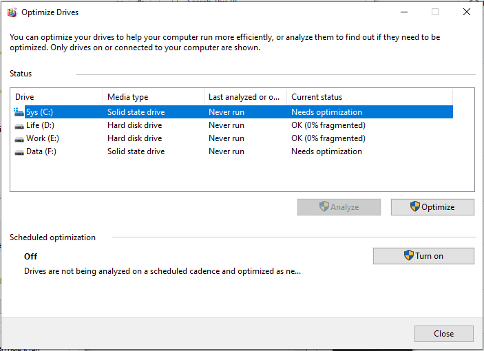
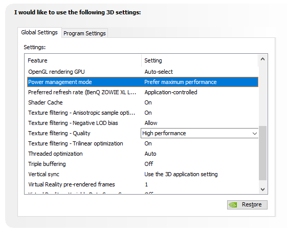
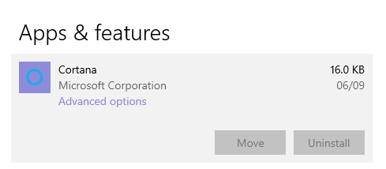
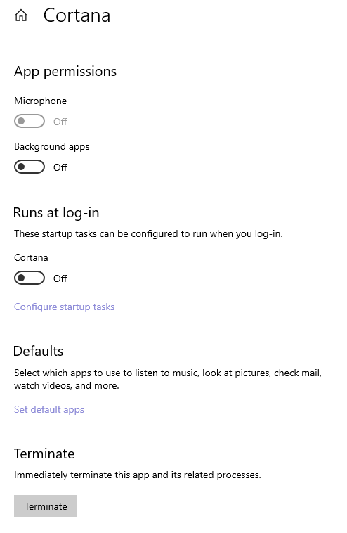

# :desktop_computer: What to do after building a pc in 2020?

I have been using laptops for ages, Dell Latitude D600 from 2003, Acer Aspire 4820 from 2010 and HPs for work. Record the steps for my first PC build, hopefully, to be of some help for the next one.


AMD R5 3600 + MSI Mortar MAX + Nvidia 1660 super


## Pre-Building

### Numbers

Size of motherboard.

Height of CPU cooler.

Length of GPU card.

Length of power supply.

Wattage of power supply.


### Shopping list

HDMI or DisplayPort cable.

Wireless USB Adapter.

Bluetooth USB Adapter.

PH2 screwdriver (for removing the default CPU bracket on the motherboard).

USB keyboard (comment from a Bluetooth keyboarder).


### Checklist

Memory slots for dual-channel setup.

Test power with fans before installing into the case.

Direction of the fans.


## Fisrt-of-all-after-building

Turn off optimisation for SSD.




Cancel indexing.


Cancel disk protection.


Update Windows.


Update video card driver: https://www.nvidia.com/en-us/geforce/drivers/

latest version: [451.67](https://www.nvidia.com/en-us/drivers/results/162105/)


Update BIOS driver.

Check BIOS version in CMD/Powershell by:

```
systeminfo
```

Latest version: [7B89v1E](https://www.msi.com/Motherboard/support/B450M-MORTAR#down-bios)


Set max performance for video card.




## Windows settings

### Apps

#### Apps & features

**Uninstall**

feedback hub
Groove Music
Mail and Calendar
MS Solitaire Collection
MS Edge
MR portal
Skype
Spotify
Tips
Voice Recorder
Weather

**Advanced options - Off and Terminate**

Cortana
Get help
Maps
Movies TV
People

**Optional features - Remove**
Windows Fax and Scan
IE11
Windows Hello Face
Windows Media Player
Math Recognizer








### System

#### About

Activate Windows.

Name your baby.


### Privacy

#### Windows permissions

offffffff (allofthem)

#### App permissions

offffff   (mostofthem)			


## More Settings

#### Monitor

Refresh rate: 144Hz


#### Chrome


```
cd C:\Users\Shaw\AppData\Local\Google\Chrome
mklink /D "C:\Users\Shaw\AppData\Local\Google\Chrome\User Data" "E:\Temp\ChromeUserData"
```


#### Win Library

Remove some

Move user library location


#### Win

theme

night light


#### Backup

Disk++


#### Mileage

C disk: 35.4G used.

All disks: 253034 objects.


## Software

### System

Chocolatey: ```choco install list.config ```

MSI light


### Coding

VS

VS Code

#### extensions


### Entertainment

Game launcher set: Battle.net, Epic, Origin, Steam, Uplay


### Win Store

xodo pdf
eartrumpet


## License

CC-BY-4.0