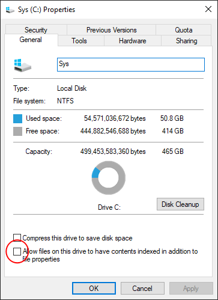

# :desktop_computer: What to do after building a pc in 2020

I have been using laptops for ages, Dell Latitude D600 from 2003, Acer Aspire 4820 from 2010 and HPs for work. Finally built one for myself.

Main parts: AMD R5 3600 + MSI Mortar MAX + Nvidia 1660 super.

Record the steps for my first PC build, hopefully, to be of some help for the next one.


Table of contents
-----------------

   * [Pre-Building](#Pre-Building)
   * [First-of-all](#First-of-all)
   * [Windows-Settings](#Windows-Settings)
   * [More-Settings](#More-Settings)
   * [Software](#Software)

<br/>

## Pre-Building

### Specifications

- Size of motherboard.

- Height of CPU cooler.

- Length of GPU card.

- Length of power supply.

- Wattage of power supply.


### Shopping list

- PH2 screwdriver (for removing the default CPU bracket on the motherboard).

- HDMI or DisplayPort cable.

- USB disk as [Windows 10 installation media](https://www.microsoft.com/en-us/software-download/windows10).

- USB keyboard (comment from a Bluetooth keyboarder).

- Wireless USB Adapter.

- Bluetooth USB Adapter.


### Checklist

- Memory slots for dual-channel setup.

- Test power via fans before screwing into the case.

- Orientation of the fans.


### OS part (15min)

1. Power on: lights on, screen on, welcome to the BIOS.
2. BIOS setting: Change the boot order to recognise USB disk.
3. Reboot to install Win10.
4. Reboot to setup Win10 (no network, no activation and turn off privacy).


## Fisrt-of-all

### Turn off optimisation

Do NOT defragment SSD .This is a windows bug and was fixed recently.


### Activate Windows

Plug wireless USB adapter on and activate Windows.


### Update Windows

Update Windows with several reboot until see the message "Up to date".


### Update GPU driver

Update video card driver: https://www.nvidia.com/en-us/geforce/drivers/

Latest version: [451.67](https://www.nvidia.com/en-us/drivers/results/162105/)

- Change the notification setting when install.


Install the driver without GF experience.

Open NVIDIA control panel:

> Set "Power management mode" to max.
>
> Set "Texture filtering - Quality" to High performance.
>
> -- <cite>JayzTwoCents [video](https://youtu.be/RYYoCXh2gtw?t=1055)</cite>


### Cancel indexing

Use other tools for global searching, so cancel the indexing on the disk.





### Cancel disk protection

Control Panel\System and Security\BitLocker Drive Encryption

Turn off the BitLocker.

- disk cleanup by the end


### Update BIOS driver

Check BIOS version in CMD/Powershell by:

```
systeminfo
```

Latest version: [7B89v1E](https://www.msi.com/Motherboard/support/B450M-MORTAR#down-bios)

Download the file into USB disk, plug in and update it.


### Hello again BIOS

Turn on XMP, so the memories can run at full frequency.

<br/>

## Windows-Settings

### Apps

#### Apps & features

**Uninstall**

 - feedback hub
 - Groove Music
 - Mail and Calendar
 - MS Solitaire Collection
 - MS Edge
 - MR portal
 - Skype
 - Spotify
 - Tips
 - Voice Recorder
 - Weather

**Advanced options - Off and Terminate**

 - Cortana
 - Get help
 - Maps
 - Movies TV
 - People
 


**Optional features - Remove**
 - Windows Fax and Scan
 - IE11
 - Windows Hello Face
 - Windows Media Player
 - Math Recognizer

### System

#### About

Activate Windows.

Name your baby.


### Privacy

#### Windows permissions

offffffff (allofthem)

#### App permissions

offffff   (mostofthem)			

<br/>

## More-Settings

#### Display

Refresh rate: 144Hz


#### Win Library

Remove unused ones.

Move user library location out of Drive C.


#### Win

Set theme.

Set night light.

Set task bar.

Add Fira Code.


#### Backup

Disk++


#### Mileage

Drive C: 35.4G used.

All Drives: 253034 objects.

<br/>

## Software

### Welcome to Windows bundle

Chocolatey: ```choco install list.config ```

MSI light


#### Chrome

Relocate the temp folder:


```
cd C:\Users\Shaw\AppData\Local\Google\Chrome
mklink /D "C:\Users\Shaw\AppData\Local\Google\Chrome\User Data" "E:\Temp\ChromeUserData"
```


### Coding

VS, set solution default location out of Drive C.

VS Code

#### extensions


### Entertainment

Game launcher bundle: Battle.net, Epic, Origin, Steam, Uplay


### Win Store

xodo pdf

eartrumpet

CrystalDiskMark

<br/>

## License

<a rel="license" href="http://creativecommons.org/licenses/by/4.0/"></a><br />This work is licensed under a <a rel="license" href="http://creativecommons.org/licenses/by/4.0/">Creative Commons Attribution 4.0 International License</a>.

